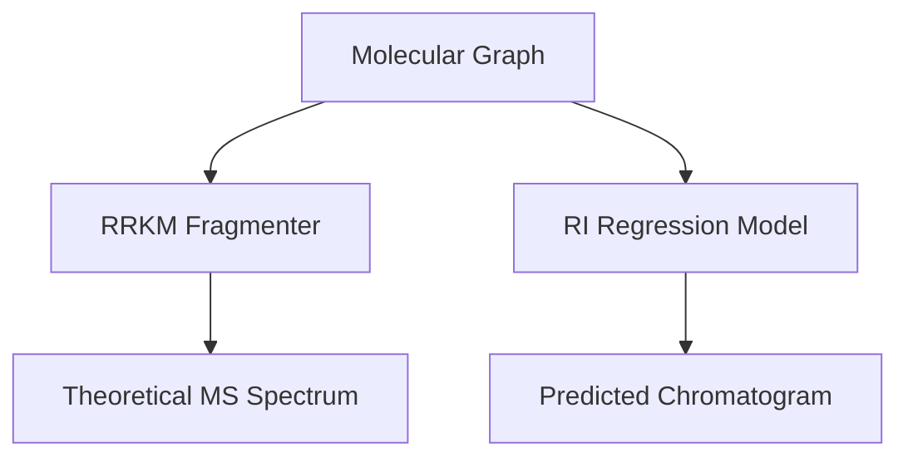

# **CoChem-MAGE: Mass and Gas-chromatography Emulator**

**PI/Developer**: Dr. Joshua John Klaassen
**ORCiD**: [https://orcid.org/0009-0007-1506-4401](https://orcid.org/0009-0007-1506-4401)
**GitHub Organization**: [https://github.com/ProfJJK-CoChem](https://github.com/ProfJJK-CoChem)

> **Important**: CoChem has recently migrated to the **Valeev Stack (MPQC, F12)** for enhanced baseline quantum energy resolutions `[M]`.

Please refer to the authoritative [CoChem User Manual](https://github.com/ProfJJK-CoChem/CoChem-BASE/blob/main/CoChem_User_Manual.md) and [Method Matrix](https://github.com/ProfJJK-CoChem/CoChem-BASE/blob/main/Method_Matrix.md) for full execution instructions and basis set provenances.

## **Overview**

**CoChem-MAGE** bridges computational chemistry with analytical chemistry by predicting Gas Chromatography Retention Indices (RI) and Electron Ionization Mass Spectrometry (EI-MS) fragmentation patterns.

Instead of performing prohibitive ab initio molecular dynamics (AIMD) for 70 eV EI-MS collisions `[E]`, MAGE utilizes RRKM statistical rate theory and rule-based graph cleavage (e.g., McLafferty rearrangements) on molecular graphs. The RRKM rate constant proxy is computed as:

$$k(E) = \nu \left(1 - \frac{E_0}{E}\right)^{s-1}$$

MAGE also predicts Kováts Retention Indices via a regression model based on molecular weight, partition coefficient, and topological polar surface area (TPSA).

## **Data Flow**



## **Setup and Installation**

1. Clone the MAGE repository:
   ```bash
   git clone https://github.com/ProfJJK-CoChem/CoChem-MAGE.git
   cd CoChem-MAGE
   pip install -r requirements.txt
   ```
2. Ensure RDKit and SciPy are available in your environment.

## **Getting Started**

1. **Verify Column Profiles**:
   ```bash
   python mage_column_registry.py
   ```
2. **Run Chromatography Simulator**:
   ```bash
   python cochem_mage_sim.py
   ```
3. **Run Central Orchestration Loop**:
   ```bash
   python cochem_mage_main.py
   ```

---
